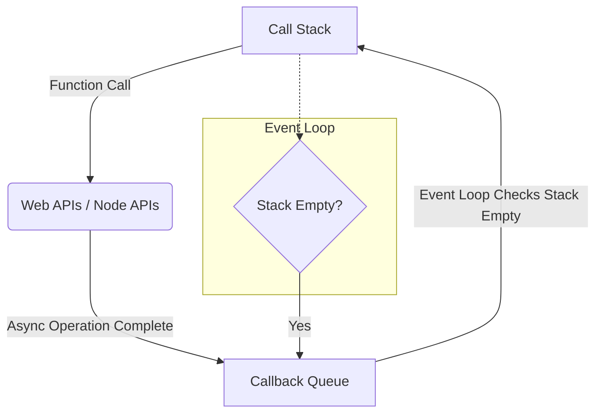

## JavaScript Fundamentals

JavaScript is a high-level, interpreted programming language that conforms to the ECMAScript specification. It is the dominant language of the web, running both in the browser (client-side) and on servers (Node.js, Deno, Cloudflare Workers).

### Key Characteristics
-   **Single-Threaded**: Executes one command at a time.
-   **Non-Blocking I/O**: Can perform long-running tasks (like network requests) without freezing the main thread.
-   **Dynamic Typing**: Variables do not have fixed types.

## The Event Loop

The Event Loop is the mechanism that allows JavaScript to perform non-blocking operations despite being single-threaded.

### How it Works
1.  **Call Stack**: Tracks function calls. When a function is invoked, it's pushed onto the stack. When it returns, it's popped off.
2.  **Web APIs (Browser) / C++ APIs (Node.js)**: Handles asynchronous operations like `setTimeout`, `fetch`, or DOM events.
3.  **Callback Queue (Task Queue)**: Holds callbacks from completed asynchronous operations, waiting to be executed.
4.  **Event Loop**: Continuously checks:
    -   Is the **Call Stack** empty?
    -   If YES, take the first item from the **Callback Queue** and push it to the **Call Stack**.

### Visualizing the Flow



### Microtasks vs. Macrotasks
-   **Macrotasks**: `setTimeout`, `setInterval`, I/O.
-   **Microtasks**: Promises (`.then`, `.catch`), `queueMicrotask`.
-   *Priority*: The Event Loop processes **all** microtasks before moving to the next macrotask. This ensures promise resolutions happen immediately after the current script.

#### Example Code
```javascript
console.log('1. Start');

setTimeout(() => {
  console.log('4. Macrotask (setTimeout)');
}, 0);

Promise.resolve().then(() => {
  console.log('3. Microtask (Promise)');
});

console.log('2. End');

// Output:
// 1. Start
// 2. End
// 3. Microtask (Promise)
// 4. Macrotask (setTimeout)
```

## Recap
-   JavaScript is **single-threaded** but uses the **Event Loop** for non-blocking I/O.
-   **Microtasks** (Promises) have higher priority than **Macrotasks** (setTimeout).
-   Understanding this order is crucial for debugging async code.

## Learn More
-   [Concurrency model and the event loop (MDN)](https://developer.mozilla.org/en-US/docs/Web/JavaScript/EventLoop)
-   [The Modern JavaScript Tutorial](https://javascript.info/)
