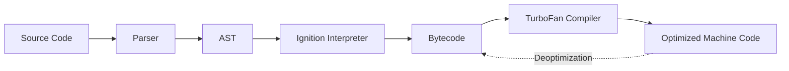

## The V8 Engine

V8 is Google's open-source high-performance JavaScript and WebAssembly engine. It is written in C++ and is used in Chrome, Node.js, and Deno.

### Core Responsibilities
-   Compiles JavaScript to native machine code.
-   Handles memory allocation.
-   Garbage collection of objects no longer needed.

## V8 Architecture

### 1. Parser
Converts JavaScript source code into an **Abstract Syntax Tree (AST)**.

### 2. Interpreter (Ignition)
Walks through the AST and generates **Bytecode**. This bytecode is executed by the interpreter.
-   *Why Bytecode?* It's smaller and faster to start up than fully compiled machine code.

### 3. Compiler (TurboFan)
Optimizes "hot" code (code that runs frequently).
-   **JIT (Just-In-Time) Compilation**: Compiles bytecode into highly optimized machine code during execution.
-   **Deoptimization**: If assumptions made by TurboFan turn out to be wrong (e.g., a variable type changes), it "de-opts" back to bytecode.
    -   *Example*: A function is optimized assuming it always adds two integers. If you suddenly pass a string, V8 must deoptimize and fall back to the interpreter.

## Memory Management

### Stack
-   Stores primitive values (numbers, booleans) and function frames.
-   Static memory allocation.
-   LIFO (Last In, First Out).

### Heap
-   Stores objects, arrays, and functions.
-   Dynamic memory allocation.
-   **Garbage Collection (Orinoco)**:
    -   **New Space (Young Generation)**: Short-lived objects. Scavenged frequently.
    -   **Old Space (Old Generation)**: Long-lived objects. Mark-Sweep-Compact algorithm used for major GC cycles.

## The Runtime Environment

V8 is just the engine. To run code, it needs a runtime environment (like a Browser or Node.js) which provides:
-   **Event Loop**: (See JavaScript Basics).
-   **Task Queues**: For managing callbacks.
-   **APIs**: `window`, `document` (Browser) or `fs`, `http` (Node.js).

## Recap
-   **V8** compiles JS to machine code using **Ignition** (Interpreter) and **TurboFan** (Compiler).
-   **JIT** allows for high performance but requires **Deoptimization** if types change.
-   Memory is managed via **Stack** (Primitives) and **Heap** (Objects).

## Learn More
-   [V8 JavaScript Engine](https://v8.dev/)
-   [Visualizing memory management in V8 Engine](https://deepu.tech/memory-management-in-v8/)
